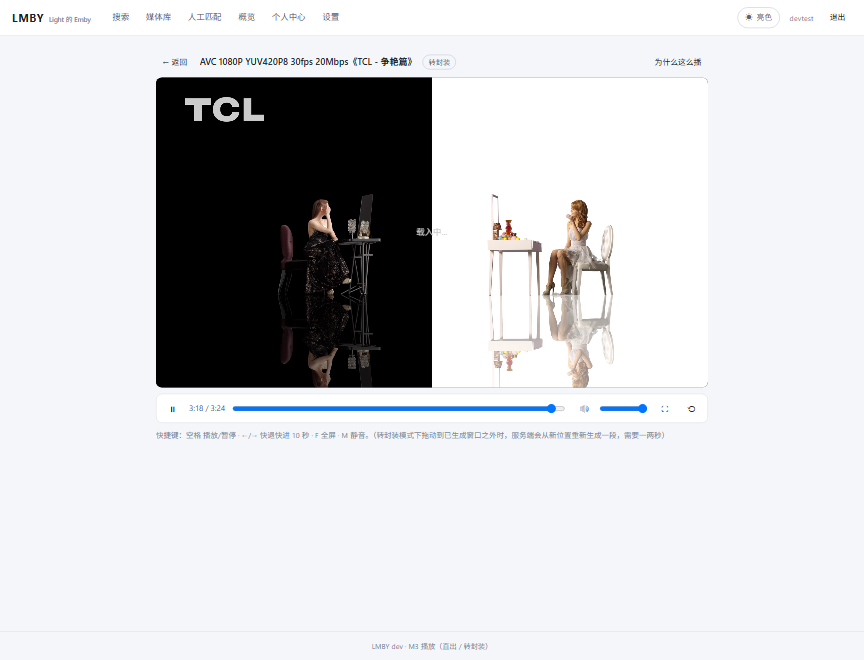
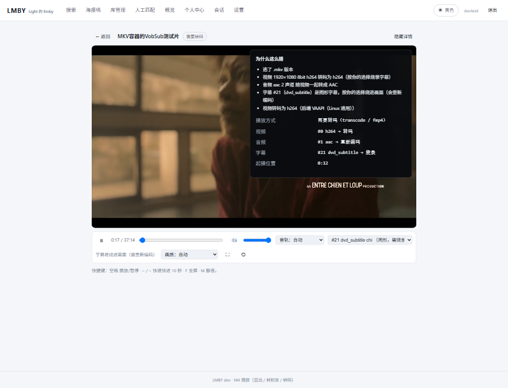
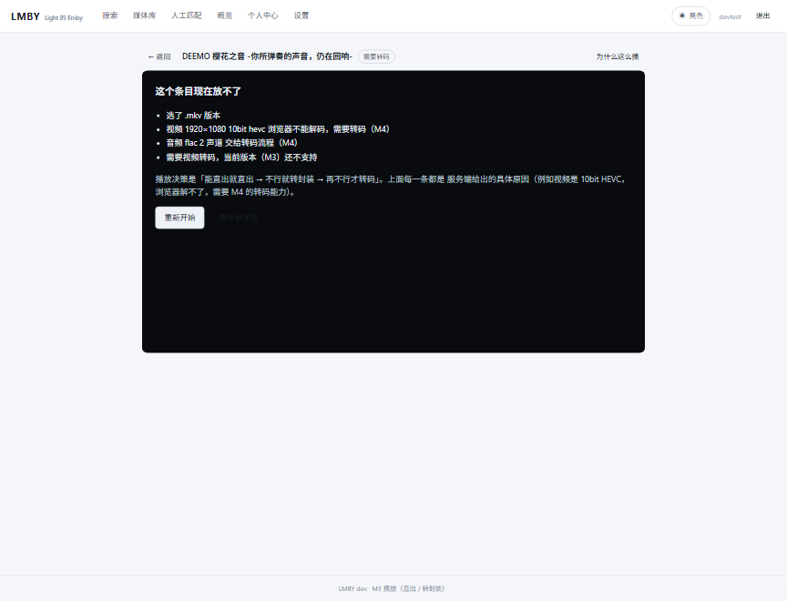
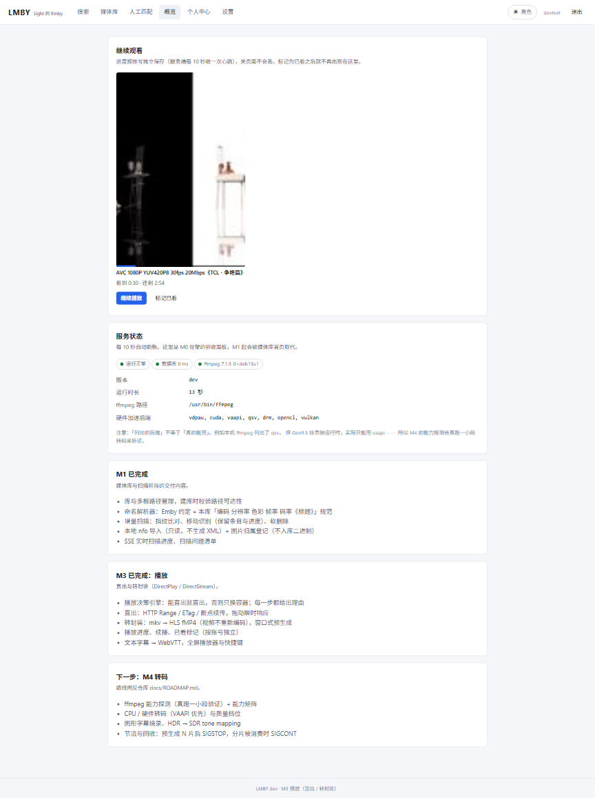

# LMBY

**L**ight 的 **E**mby —— 一个刻意做小的自托管媒体服务器。

Emby / Jellyfin 功能齐全，代价是重量与兼容性负担。LMBY 反过来：只做「**在浏览器里看自己的影视库**」这件事，
把它做到够用、可控、好部署。

---

## 定位

> **纯 Web 的在线播放站点**：浏览器是唯一客户端，HTTP 是唯一出口。

因此 LMBY 不做、也不打算做：DLNA/UPnP、Emby/Jellyfin 专有客户端协议、插件系统、音乐库。
这些不是「还没做」，而是「故意不做」—— 它们占了 Emby 大部分复杂度，却不是自用场景的核心价值。
（**直播电视是例外**：它在计划里，见 M5；理由一样 —— 自用场景真的会看。）

## 技术形态

| 层 | 选型 |
|---|---|
| 后端 | Go（标准库 `net/http` 路由、`pgx/v5` 手写 SQL、`slog`） |
| 前端 | React + TypeScript + Vite（构建期用 Node，**运行期零 Node**） |
| 存储 | PostgreSQL 16+（**必须 UTF8 编码 + UTF-8 的 lc_ctype**，如 `C.UTF-8`） |
| 转码 | 外部 ffmpeg + HLS |
| 任务队列 | PostgreSQL 表（不引 Redis/MQ） |

**部署物只有两件：一个二进制 + 一个 PostgreSQL。**

依赖纪律与取舍详见 [`docs/ADR/0001-stdlib-first.md`](docs/ADR/0001-stdlib-first.md)。

## 功能

现在能用的：

- **账号与个人中心**：初始化向导 / 登录登出（argon2id）、改口令并踢掉其他设备、显示名、
  我的设备、外观偏好、登录失败限流、`/healthz` 健康检查、结构化日志
- **媒体库与扫描**：库 CRUD + 多根路径、增量扫描（`(path,size,mtime)` 指纹 + **移动识别**）、
  软删除、命名解析器（**零改名接管 Emby 现有目录**）、扫描问题清单、SSE 实时进度
- **本地元数据优先**：媒体同目录的 `nfo`（`tvshow.nfo` / `season.nfo` / `S01E01.nfo`，
  细到每一集）与图片；只有本地没有与格式不对才去刮
- **元数据刮削**：TMDB provider（搜索/详情/别名/季集/图片）+ `provider_cache` jsonb 缓存
  （重刮零 API 调用）+ PostgreSQL 任务队列（不引 Redis）+ **匹配打分器**
  （中文二元组、繁简折叠、别名、集数-时长结构信号；阈值以上自动、以下进人工队列）
- **人工干预**：人工匹配（候选并列对比 + 打分明细 + 海报）、条目编辑（12 个字段）+
  **字段锁定**（锁住的字段任何自动流程都写不进去）、**批量操作**（多选后批量重刮/标记）
- **浏览**：**海报墙**（顶层条目，可按标题/年份/最近添加排序）与**剧集视图**（季标签 → 集列表 → 点进条目页）
- **图片管线**：本地图优先、按需缩放、内容寻址缓存、缺图回源 TMDB、ETag/304
- **搜索**：中文二元组切词 + 单字兜底 + **错字容忍**（调低 pg_trgm 词相似阈值）
- **播放（M3）**：
  - **播放决策引擎**：能直出就直出（原文件 + HTTP Range/ETag/断点续传），
    否则只换容器（转封装 HLS fMP4，**视频不重新编码**），两者都不行才判「需要转码」；
    **每一步都带理由**（界面上的「为什么这么播」直接展示，而不是一个黑屏）
  - **客户端能力上报**：浏览器用 `MediaSource.isTypeSupported` 实测自己支持什么编码，
    服务端据此决定能不能直出（保守默认档兜底）
  - **播放器**：自研控制条（播放/拖动/音量/全屏/音轨与字幕切换）、快捷键、
    转封装模式下的**窗口续段**（拖到已生成区间之外自动从新位置重开一段）、
    直出模式拖动瞬时响应
  - **进度**：服务端每 10 秒收一次心跳，续播、已看标记、首页「继续观看」；
    关闭页面/离开播放器时 `sendBeacon` 上报并**立刻回收 ffmpeg 与分片**（实测 1 秒内）
  - **字幕**：三种形态按「能不能还原原意」分 —— ASS/SSA **原样抽出来交给前端 libass**（定位、
    动画、卡拉OK、矢量绘图全保住）、纯文本（subrip…）转 WebVTT 走浏览器原生轨道、
    **图形字幕（PGS/VobSub）烧进画面**（用户显式选择；界面会写明「需重新编码」这个代价）
- **转码（M4）**：
  - **硬件能力真跑探测**：启动时后台实测 `-hwaccels` / `-encoders` / `-filters`，并**拿 1 秒小样真编一遍**，
    结果落盘缓存（`capabilities.json`，接口也能读）——只有真跑通过的编码器才会被用
  - **转码参数配方**：按后端（VAAPI / QSV / NVENC / VideoToolbox / 软件）拼滤镜链与码率模式
    （CQP/CBR/VBR 按探测结果选）、强制关键帧对齐分片、HDR→SDR 走软件 `zscale`+`tonemap`
  - **播放器画质档**：自动 / 原生 / 1080p…144p（只列比源低的档）；选了低档即使能直出也转码，切档从当前位置续播
  - **节流与回收**：预生成跑到客户端前面超过阀值就 `SIGSTOP` 暂停 ffmpeg（追上来 `SIGCONT`），
    空闲回收进程与分片
  - **会话监控页**（管理员）：活跃会话、实时 fps/速度/码率、一键终止
  - **错误不误伤**：硬解起不来时自动换成软件解码 + 同一个硬件编码器；机器真编不了就如实给出理由，
    不把能看的片子变成「放不了」
- **直播电视（M5）**：
  - **频道来自 M3U**：粘贴 / 订阅 URL 拉取，按**地址**做增量更新 —— 同一地址只更新元数据，
    停用状态、收藏、探测结果一律不覆盖（否则刷新一次订阅源就把用户手动停用的频道全打开了）；
    删源不删频道
  - **每频道只跑一路 ffmpeg**：所有观众共享同一个会话；谁都不看了按空闲回收，
    播放列表是滚动窗口（旧分片边滚边删，不会无限占盘）
  - **浏览器直接看**：`-c:v copy` 不转码、音频 MP2→AAC（IPTV 源大多是 MP2，浏览器放不了）、
    1 秒分片 —— 分片时长就是起播延迟的下限，实测起播 1.35 秒
  - **外部播放器出口**：`GET /s/<token>/playlist.m3u`，token 是 HMAC 签名 + 带过期
    （给 VLC / 手机播放器；限次数 / 限下载尚未做）
  - 频道管理 GUI、直播播放器、订阅源定时刷新与失效频道标记都已完成；没有回看 / 时移 / EPG / 录制
- **设置页**（管理员，11 个页签）：元数据与服务状态、转码与硬件、日志、库管理、扫描计划、
  人工匹配、会话、直播源、用户、审计日志、缓存与清理。TMDB 凭据在界面上填、**保存即生效**
  （不必重启），密钥加密存库且**只写不回显**，带「测试连接」与系统信息（含数据库字符集自检）
- **运维**：**审计日志**（谁在什么时候做了什么；口令与密钥不入审计）、**缓存与清理**
  （只碰缓存与孤儿，绝不碰媒体文件）、**备份 / 恢复**（`lmby backup` / `lmby restore`，
  恢复会清空目标库，必须 `--yes`）、**给 bot / 脚本的用户管理密钥**（只在用户管理接口生效）
- **Web 界面**：明暗主题（首屏生效、跟随系统、登录后同步账号）、纯浏览器播放（M3）

### 功能截图

| 海报墙 | 剧集视图 | 搜索 |
|---|---|---|
|  |  |  |

| 人工匹配 | 条目编辑（字段锁定） | 设置 |
|---|---|---|
|  |  |  |

| 播放器（转封装） | 图形字幕烧录（PGS/VobSub） | 放不了时的理由 | 首页继续观看 |
|---|---|---|---|
|  |  |  |  |

## 快速开始

### Docker（推荐）

```bash
cd deploy
POSTGRES_PASSWORD=$(openssl rand -hex 16) \
LMBY_ADMIN_PASSWORD='换成你的口令' \
docker compose up -d
```

打开 `http://localhost:8099`，先在向导里建管理员；进去后右上角「设置」把 TMDB 凭据填上
（也可以写进 `config.toml`，但设置页里填**保存即生效**、不必重启）。
核显转码需要 `/dev/dri`（compose 里已映射，没有核显可删掉该段）。
官方 `postgres` 镜像建库本来就是 UTF8 + UTF-8 locale，无需额外处理。

### 手动部署

```bash
# 1. 编译（前端 + 后端 → 单二进制）
task build          # 等价于 cd web && npm run build && go build -o lmby ./cmd/lmby

# 2. 准备数据库与配置
#    注意：createdb 必须指定编码与 locale。宿主 locale 是 C 时（很多最小化系统默认就是），
#    不加这些参数建出来的是 SQL_ASCII + C 的库 —— 那种库里中文会退化成字节，
#    中文搜索、模糊匹配会静默失效（LMBY 启动时会直接拦下并告诉你修法）。
sudo -u postgres psql -c "create role lmby login password '你的口令'"
sudo -u postgres createdb -E UTF8 --lc-collate=C.UTF-8 --lc-ctype=C.UTF-8 -T template0 -O lmby lmby
sudo cp deploy/lmby.example.toml /etc/lmby/config.toml   # 改掉其中的 dsn

# 已经建错字符集的库可以就地重建（会备份、逐表比对行数、跑中文自检）：
#   sudo systemctl stop lmby && bash scripts/dev/fix-db-encoding.sh && sudo systemctl start lmby

# 3. 启动（会自动应用迁移）
./lmby serve --config /etc/lmby/config.toml
```

首次打开会进入**初始化向导**，创建第一个管理员账号。
也可以在启动前设置 `LMBY_ADMIN_PASSWORD`，由程序自动创建 `admin` 账号。

### systemd

```bash
sudo install -m 755 lmby /usr/local/bin/lmby
sudo install -m 644 deploy/lmby.service /etc/systemd/system/lmby.service
sudo systemctl enable --now lmby
```

## 配置

优先级：内置默认值 < 配置文件 < 环境变量（`LMBY_*`）。
完整键位见 [`deploy/lmby.example.toml`](deploy/lmby.example.toml)。

常用环境变量：

| 变量 | 说明 |
|---|---|
| `LMBY_LISTEN` | 监听地址，默认 `:8099` |
| `LMBY_DATA_DIR` | 运行期数据目录 |
| `LMBY_DATABASE_DSN` | PostgreSQL 连接串 |
| `LMBY_DATABASE_MAX_CONNS` | 连接池上限 |
| `LMBY_AUTO_MIGRATE` | 启动时自动应用迁移（默认 `true`）|
| `LMBY_ADMIN_PASSWORD` | 首次启动自动创建管理员 |
| `LMBY_TMDB_READ_TOKEN` | TMDB v4 Read Access Token（元数据刮削用）|
| `LMBY_TMDB_API_KEY` | TMDB v3 API Key（与上者二选一）|
| `LMBY_TMDB_LANGUAGE` | 语言，默认 `zh-CN` |
| `LMBY_FFMPEG_PATH` | 指定 ffmpeg 可执行文件 |
| `LMBY_FFPROBE_PATH` | 指定 ffprobe 可执行文件 |
| `LMBY_TASKS_WORKERS` | 后台任务 worker 数 |
| `LMBY_LOG_LEVEL` | `debug` / `info` / `warn` / `error` |
| `LMBY_SECURE_COOKIES` | 走 HTTPS 时置 `true` |
| `LMBY_SESSION_TTL_HOURS` | 会话有效期（小时）|

## 硬件加速（实测结论）

在 Intel UHD 630（Comet Lake，Gen9.5）+ Debian 13 上：

- ✅ **VAAPI 可用**：H264/HEVC 硬件编解码，1080p 约 8~11x 实时
- ❌ **QSV 不可用**：Debian 13 已移除 legacy MediaSDK，`libmfx-gen` 只支持 Gen12+，
  `vpl-inspect` 明确报告 `no implementations found`

这个例子正是 LMBY 的一条设计原则：**能力必须运行时实测，不能只看 `ffmpeg -encoders` 列表**
（那里明明列着 `h264_qsv`，但它在这台机器上跑不起来）。
完整数据与参数坑见 [`docs/TRANSCODING.md`](docs/TRANSCODING.md)。

## 文档

| 文件 | 内容 |
|---|---|
| [`docs/API.md`](docs/API.md) | HTTP 接口参考（认证、统一错误、逐条端点参数与响应） |
| [`docs/BOT-API.md`](docs/BOT-API.md) | 给 bot / 脚本的用户管理密钥（最小权限）用法 |
| [`docs/TRANSCODING.md`](docs/TRANSCODING.md) | 硬件加速实测矩阵与参数坑 |
| [`docs/RELEASING.md`](docs/RELEASING.md) | 发布流程（dev → main 的差异与剥离脚本） |
| [`docs/ADR/`](docs/ADR/) | 技术决策记录（为什么只用标准库） |
| [`docs/releases/`](docs/releases/) | 逐版发版说明 |

## 许可

AGPL-3.0-only。
