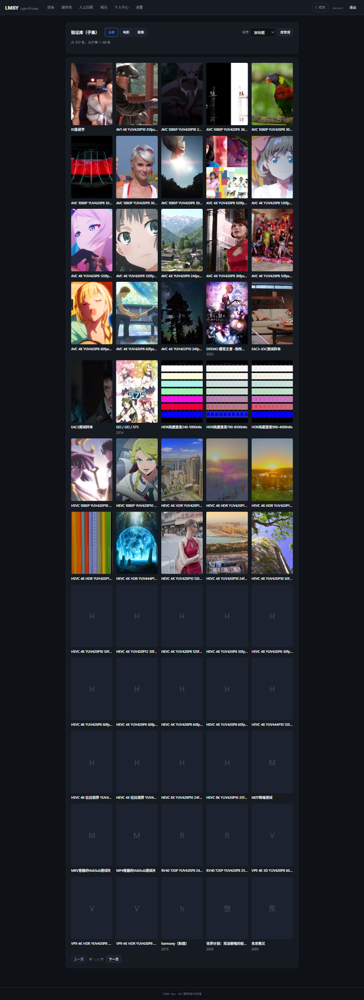
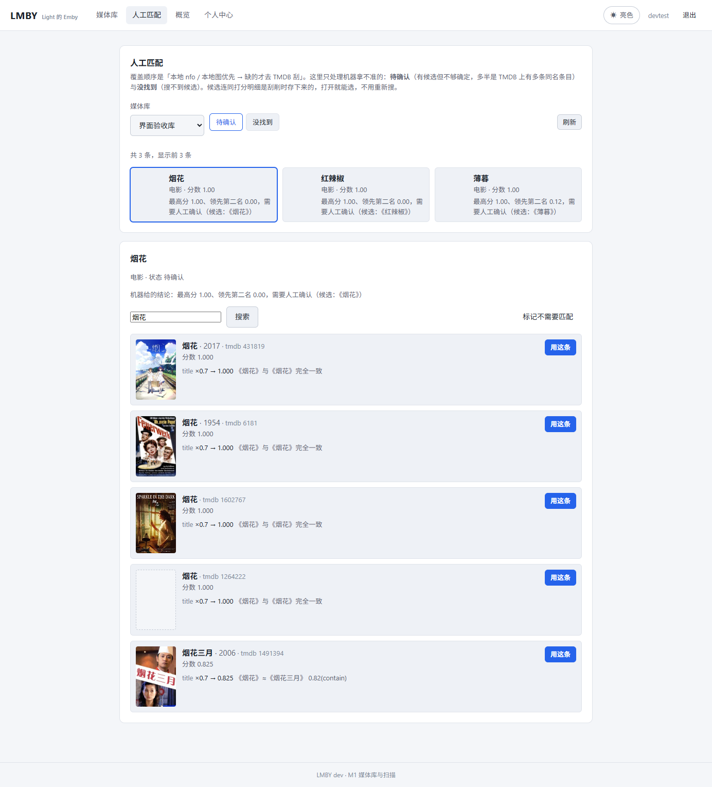
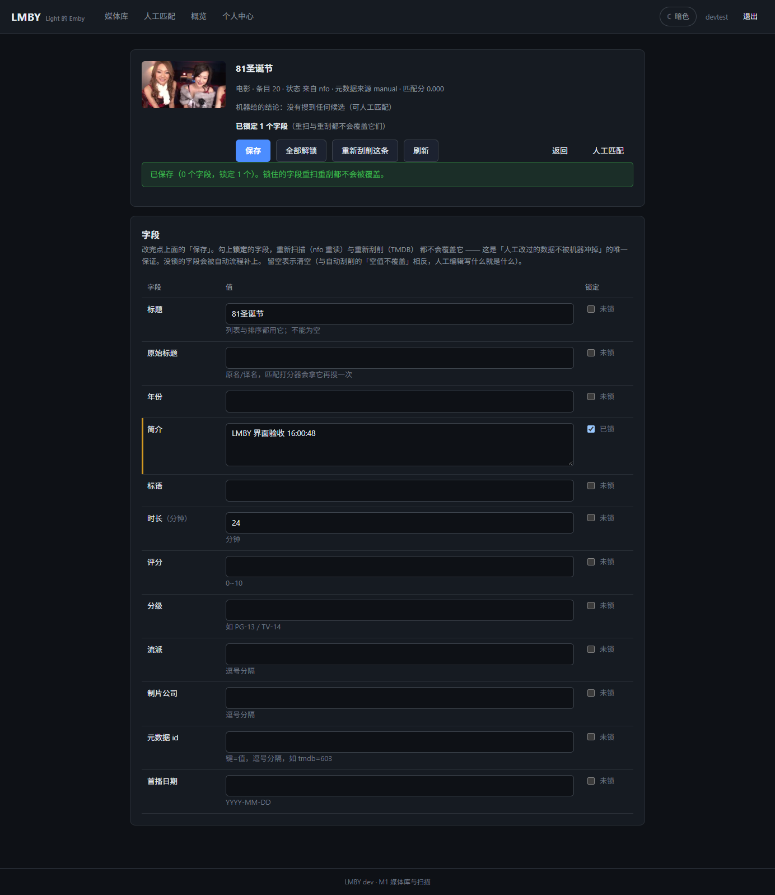
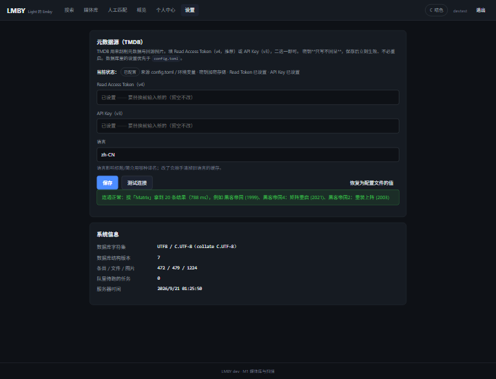

# LMBY

**L**ight 的 **E**mby —— 一个刻意做小的自托管媒体服务器。

Emby / Jellyfin 功能齐全，代价是重量与兼容性负担。LMBY 反过来：只做「**在浏览器里看自己的影视库**」这件事，
把它做到够用、可控、好部署。

---

## 定位

> **纯 Web 的在线播放站点**：浏览器是唯一客户端，HTTP 是唯一出口。

因此 LMBY 不做、也不打算做：DLNA/UPnP、Emby/Jellyfin 专有客户端协议、插件系统、音乐库。
这些不是「还没做」，而是「故意不做」—— 它们占了 Emby 大部分复杂度，却不是自用场景的核心价值。
（**直播电视是例外**：它在计划里，见 M5；理由一样 —— 自用场景真的会看。）

## 技术形态

| 层 | 选型 |
|---|---|
| 后端 | Go（标准库 `net/http` 路由、`pgx/v5` 手写 SQL、`slog`） |
| 前端 | React + TypeScript + Vite（构建期用 Node，**运行期零 Node**） |
| 存储 | PostgreSQL 16+（**必须 UTF8 编码 + UTF-8 的 lc_ctype**，如 `C.UTF-8`） |
| 转码 | 外部 ffmpeg + HLS |
| 任务队列 | PostgreSQL 表（不引 Redis/MQ） |

**部署物只有两件：一个二进制 + 一个 PostgreSQL。**

依赖纪律与取舍详见 [`docs/ADR/0001-stdlib-first.md`](docs/ADR/0001-stdlib-first.md)。

## 进度与功能

**M0（骨架）、M1（媒体库与扫描）、M2（元数据与刮削）均已完成，并在真实容器 + 真实浏览器上实测验收。**
下一步是 **M3 播放核心** —— v0.1 打算发在那里。逐项清单与验收记录见
[`docs/ROADMAP.md`](docs/ROADMAP.md)。

现在能用的：

- **账号与个人中心**：初始化向导 / 登录登出（argon2id）、改口令并踢掉其他设备、显示名、
  我的设备、外观偏好、登录失败限流、`/healthz` 健康检查、结构化日志
- **媒体库与扫描**：库 CRUD + 多根路径、增量扫描（`(path,size,mtime)` 指纹 + **移动识别**）、
  软删除、命名解析器（**零改名接管 Emby 现有目录**）、扫描问题清单、SSE 实时进度
- **本地元数据优先**：媒体同目录的 `nfo`（`tvshow.nfo` / `season.nfo` / `S01E01.nfo`，
  细到每一集）与图片；只有本地没有与格式不对才去刮
- **元数据刮削**：TMDB provider（搜索/详情/别名/季集/图片）+ `provider_cache` jsonb 缓存
  （重刮零 API 调用）+ PostgreSQL 任务队列（不引 Redis）+ **匹配打分器**
  （中文二元组、繁简折叠、别名、集数-时长结构信号；阈值以上自动、以下进人工队列）
- **人工干预**：人工匹配（候选并列对比 + 打分明细 + 海报）、条目编辑（12 个字段）+
  **字段锁定**（锁住的字段任何自动流程都写不进去）、**批量操作**（多选后批量重刮/标记）
- **浏览**：**海报墙**（顶层条目，可按标题/年份/最近添加排序）与**剧集视图**（季标签 → 集列表 → 点进条目页）
- **图片管线**：本地图优先、按需缩放、内容寻址缓存、缺图回源 TMDB、ETag/304
- **搜索**：中文二元组切词 + 单字兜底 + **错字容忍**（调低 pg_trgm 词相似阈值）
- **设置页**（管理员）：在界面上填 TMDB 凭据、**保存即生效**（不必重启），
  密钥加密存库且**只写不回显**，带「测试连接」与系统信息（含数据库字符集自检）
- **Web 界面**：明暗主题（首屏生效、跟随系统、登录后同步账号）、纯浏览器播放（M3）

### 功能截图

| 海报墙 | 剧集视图 | 搜索 |
|---|---|---|
|  |  |  |

| 人工匹配 | 条目编辑（字段锁定） | 设置 |
|---|---|---|
|  |  |  |

### 验收（全部真环境实跑）

| 脚本 | 结果 | 覆盖 |
|---|---|---|
| `scripts/dev/smoke-test.sh` | **42/42** | 接口与鉴权边界、会话、偏好、改口令踢设备、登出、静态兜底、非法输入 |
| `scripts/dev/browser-test.mjs` | **26/26** | CDP 驱动真实 Chrome：首屏跟随系统主题、明暗切换与持久化、初始化向导、概览页、个人中心、主题同步账号、界面改口令、重新登录 |
| `scripts/dev/m1-ui-test.mjs` | **18/18** | 媒体库页、扫描进度、条目表、主题 |
| `scripts/dev/match-sample.sh` | **10 条样本 9 条 auto、0 条误配** | 真 TMDB 抽样，自动匹配率（DoD 要 ≥ 90%）|
| `scripts/dev/verify-item-edit.sh` | **42/42** | 字段锁定的 DoD：改字段 → 锁住 → 重扫，**带对照组**（没锁的字段被 nfo 改写回去），跑完自还原 |
| `scripts/dev/item-edit-ui-test.mjs` | **37/37** | 条目编辑界面：保存、非法输入被挡、加锁/解锁、切主题不丢状态 |
| `scripts/dev/verify-search-sql.sh` | **15/15** | 中文切词、生成列、索引、索引侧与查询侧切法一致 |
| `scripts/dev/verify-search.sh` | **26/26** | 真库搜索：整标题/中段/错字/单字、库与类型过滤、分页、改完标题立即可搜 |
| `scripts/dev/verify-browse.sh` | **40/40** | 海报墙只给顶层、层级 parentId、每季集数、排序分页、批量入队/标记（跑完还原）|
| `scripts/dev/verify-settings.sh` | **38/38** | 密钥不回显、非管理员 403、存库是密文、**保存即生效（填错 token → 真请求立刻失败）**、回落配置文件 |
| `scripts/dev/m2-ui-test.mjs` | **34/34** | 海报墙、剧集视图、批量选择、设置页（测试连接/保存/恢复）|
| `scripts/dev/search-ui-test.mjs` | **22/22** | 搜索界面：导航、查询、错字命中、进条目页、URL 参数、筛选、主题 |

这些脚本都不依赖测试框架（curl + jq / Node 内置 `WebSocket` 直连 Chrome DevTools Protocol）。
用法与数据库字符集坑见 [`docs/DEV-ENV.md`](docs/DEV-ENV.md)。

文档：

| 文件 | 内容 |
|---|---|
| [`docs/REQUIREMENTS.md`](docs/REQUIREMENTS.md) | 需求、范围边界、设计取舍 |
| [`docs/ROADMAP.md`](docs/ROADMAP.md) | M0~M9 路线图与逐项验收标准 |
| [`docs/ADR/`](docs/ADR/) | 技术决策记录（为什么只用标准库） |
| [`docs/DEV-ENV.md`](docs/DEV-ENV.md) | 开发环境、部署流程、验收脚本用法 |
| [`docs/TRANSCODING.md`](docs/TRANSCODING.md) | 硬件加速实测矩阵与已踩过的坑 |

## 快速开始

### Docker（推荐）

```bash
cd deploy
POSTGRES_PASSWORD=$(openssl rand -hex 16) \
LMBY_ADMIN_PASSWORD='换成你的口令' \
docker compose up -d
```

打开 `http://localhost:8099`，先在向导里建管理员；进去后右上角「设置」把 TMDB 凭据填上
（也可以写进 `config.toml`，但设置页里填**保存即生效**、不必重启）。
核显转码需要 `/dev/dri`（compose 里已映射，没有核显可删掉该段）。
官方 `postgres` 镜像建库本来就是 UTF8 + UTF-8 locale，无需额外处理。

### 手动部署

```bash
# 1. 编译（前端 + 后端 → 单二进制）
task build          # 等价于 cd web && npm run build && go build -o lmby ./cmd/lmby

# 2. 准备数据库与配置
#    注意：createdb 必须指定编码与 locale。宿主 locale 是 C 时（很多最小化系统默认就是），
#    不加这些参数建出来的是 SQL_ASCII + C 的库 —— 那种库里中文会退化成字节，
#    中文搜索、模糊匹配会静默失效（LMBY 启动时会直接拦下并告诉你修法）。
sudo -u postgres psql -c "create role lmby login password '你的口令'"
sudo -u postgres createdb -E UTF8 --lc-collate=C.UTF-8 --lc-ctype=C.UTF-8 -T template0 -O lmby lmby
sudo cp deploy/lmby.example.toml /etc/lmby/config.toml   # 改掉其中的 dsn

# 已经建错字符集的库可以就地重建（会备份、逐表比对行数、跑中文自检）：
#   sudo systemctl stop lmby && bash scripts/dev/fix-db-encoding.sh && sudo systemctl start lmby

# 3. 启动（会自动应用迁移）
./lmby serve --config /etc/lmby/config.toml
```

首次打开会进入**初始化向导**，创建第一个管理员账号。
也可以在启动前设置 `LMBY_ADMIN_PASSWORD`，由程序自动创建 `admin` 账号。

### systemd

```bash
sudo install -m 755 lmby /usr/local/bin/lmby
sudo install -m 644 deploy/lmby.service /etc/systemd/system/lmby.service
sudo systemctl enable --now lmby
```

## 配置

优先级：内置默认值 < 配置文件 < 环境变量（`LMBY_*`）。
完整键位见 [`deploy/lmby.example.toml`](deploy/lmby.example.toml)。

常用环境变量：

| 变量 | 说明 |
|---|---|
| `LMBY_LISTEN` | 监听地址，默认 `:8099` |
| `LMBY_DATA_DIR` | 运行期数据目录 |
| `LMBY_DATABASE_DSN` | PostgreSQL 连接串 |
| `LMBY_DATABASE_MAX_CONNS` | 连接池上限 |
| `LMBY_AUTO_MIGRATE` | 启动时自动应用迁移（默认 `true`）|
| `LMBY_ADMIN_PASSWORD` | 首次启动自动创建管理员 |
| `LMBY_TMDB_READ_TOKEN` | TMDB v4 Read Access Token（元数据刮削用）|
| `LMBY_TMDB_API_KEY` | TMDB v3 API Key（与上者二选一）|
| `LMBY_TMDB_LANGUAGE` | 语言，默认 `zh-CN` |
| `LMBY_FFMPEG_PATH` | 指定 ffmpeg 可执行文件 |
| `LMBY_FFPROBE_PATH` | 指定 ffprobe 可执行文件 |
| `LMBY_TASKS_WORKERS` | 后台任务 worker 数 |
| `LMBY_LOG_LEVEL` | `debug` / `info` / `warn` / `error` |
| `LMBY_SECURE_COOKIES` | 走 HTTPS 时置 `true` |
| `LMBY_SESSION_TTL_HOURS` | 会话有效期（小时）|

刮削与匹配的取舍（为什么给搜索不传年份、为什么必须取详情看别名）见
[`docs/ROADMAP.md`](docs/ROADMAP.md) 的验收记录。

## 开发

```bash
bash scripts/dev/setup-pg.sh   # 准备 PostgreSQL 角色/库（UTF8 + C.UTF-8）与 /etc/lmby/config.toml
task web:dev    # 终端 1：Vite 开发服务器（前端热更新）
task run        # 终端 2：后端
task check      # 提交前：vet + test + 前端构建
```

容器里的完整开发流程（编译 / golangci-lint / 各阶段验收脚本）见
[`docs/DEV-ENV.md`](docs/DEV-ENV.md)。

数据库迁移就是往 `migrations/` 加一个 `NNNN_描述.sql`，格式与注意事项见
[`migrations/embed.go`](migrations/embed.go) 的包注释。

### 硬件加速实测（结论）

在 Intel UHD 630（Comet Lake，Gen9.5）+ Debian 13 上：

- ✅ **VAAPI 可用**：H264/HEVC 硬件编解码，1080p 约 8~11x 实时
- ❌ **QSV 不可用**：Debian 13 已移除 legacy MediaSDK，`libmfx-gen` 只支持 Gen12+，
  `vpl-inspect` 明确报告 `no implementations found`

这个例子正是 LMBY 的一条设计原则：**能力必须运行时实测，不能只看 `ffmpeg -encoders` 列表**
（那里明明列着 `h264_qsv`，但它在这台机器上跑不起来）。
完整数据与参数坑见 [`docs/TRANSCODING.md`](docs/TRANSCODING.md)。

## 许可

AGPL-3.0-only。
